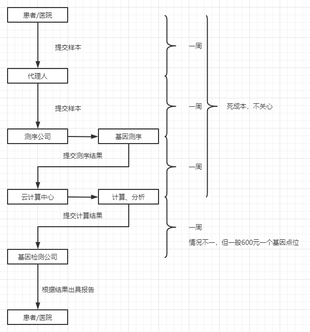
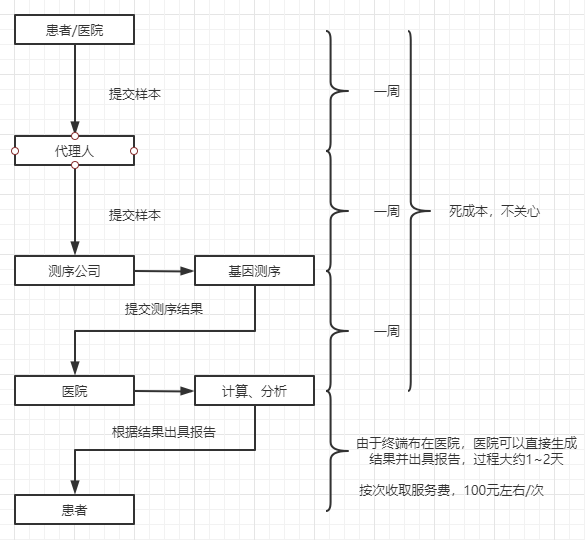

# 高速基因比对设备
 &nbsp;&nbsp;&nbsp;&nbsp;本设备是通过利用布尔逻辑进行基因计算来提高基因比对处理的效率的。当前条件下的通过寻找突变基因来对疾病进行精确治疗的过程是十分繁琐的。

 &nbsp;&nbsp;&nbsp;&nbsp;对于患者和医院来说，需要先提供样本，再通过代理人送去测序公司进行测序，接着再通过云计算中心对大量的测序数据进行计算和分析，之后检测公司再根据以上计算结果出具一份诊断报告，最后再由医生根据诊断报告进行治疗。这一过程设计的环节多，过程复杂，耗时很长，一般需要耗时一个多月，这对于一些发病急、痛苦大、预后差的疾病来说是不可容忍的。

 &nbsp;&nbsp;&nbsp;&nbsp;本设备通过运用基于布尔逻辑的一套算法可以极大地提升对于大量测序数据的计算和分析的速度。使得整个流程剥离了传统方法中耗时最长的检测环节，使得报告的出具脱离了传统的检测公司，患者和医院在获得测序结果之后即可快速拿到诊断报告，大大缩短患者的等待时间，使患者和医生可以快速、精准地配合。

