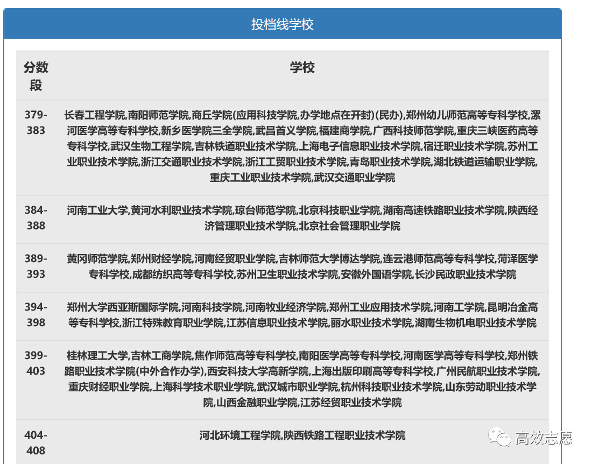

  高效志愿中的历年的分数线数据来自河南省招办和各大学的招生办。2019年的预测分数线数据则根据各大学和专业在河南省招生的计划，考生成绩和位次，通过大数据分析历年录取情况，结合专业和学校热度建立了数学模型。针对全国2900多所院校录取分数进行预测，2016，2017，2018年对一本院校的预测结果表明，97%的学校的预测结果误差在3分之内。以大数据为基础进行分数线预测，高效志愿是您高考志愿填报的最优选择！值此志愿填报季，高效志愿特针对河南考生推出《志愿填报分析报告》，帮助您找到心仪的院校，迈入理想中的大学殿堂。

**高效志愿“志愿填报分析”分为以下三步：**

#### Step1

—   个人情况分析    —

  个人情况分析通过分析您的位次信息，并根据位次信息给出相同位次2016-2018年对应的分数。您可根据对应的分数去对比各个学校历年录取分数线，选择学校和专业。

  高效志愿将分数与位次结合，分析您的分数分布、位次分布，深层次挖掘历年分数信息，通过分析往年数据，大数据 + 智能推荐 + 多重分析，为您量身定制一套完美志愿方案。

  ▲ 找大学、选专业、测录取概率、填报志愿……高效志愿为您保驾护航。

  相同位历年分数、学生分数分布累计，深层次分析个人情况

  **小提示** 

高效志愿建议考生选择以位次+分数为主的填报方式。将位次转换为历年分数，再通过比较分数，选择合适的院校，位次与分数结合，打造出最具性价比的填报志愿方案~

#### Step2

—   推荐学校概况   —

  五分考、五分报，挑选学校很重要，推荐学校概述先根据考生成绩范围推荐了录取分数在-40~+10之间的学校，在为您推荐的学校中，考生可以结合自身情况快速的确定可填报的院校，多种类院校供您参考，多层次的院校让您选择。为每个分数段智能推荐院校，避免高不成、低不就的择校难题。

#### Step3

—   推荐学校一览    —

  推荐学校一览部分给出了2019年各个学校预测分数线供考生参考，并给出了2016-2018年的录取分数，学校招办电话和网址等信息供参考。通过参考学校的信息，您可以直观的看到每个院校的概况及预测分数线，通过比较您的分数与预测分数线、历年录取分数线，可以得到明确、直观的结论。
